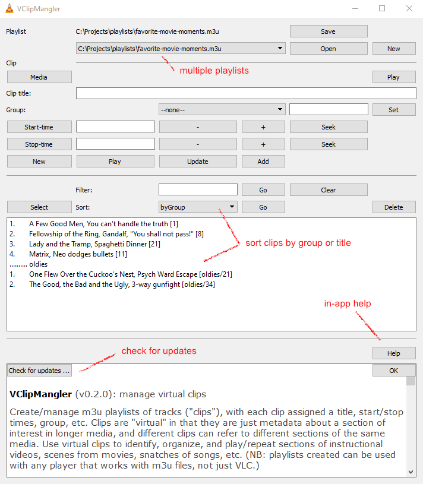

# VclipMangler

This is a VLC extension to create and manage playlists of virtual clips.

Create/manage m3u playlists of tracks ("clips"), with each clip assigned a title, start/stop times, group, etc.

Clips are "virtual" in that they are just metadata about a section of interest in longer media, and different clips can refer to different sections of the same media.

Use virtual clips to identify, organize, and play/repeat sections of instructional videos, scenes from movies, snatches of songs, etc.

(NB: playlists created can be used with any player that works with m3u files, not just VLC.)

## How to install

- download this repo
- extract/place VclipMangler.lua in your VLC extensions folder, usually `{your VLC folder}/lua/extensions`
- re-start VLC (or click VLC menu > Tools > Plugins and Extensions, then in the dialog that appears click Active Extensions > Reload extensions)

## How to run

- (after installing as above)
- click VLC menu/View/Manage Virtual Clips

## How to use

(tbd; for now pls click the Help button in VclipMangler)
