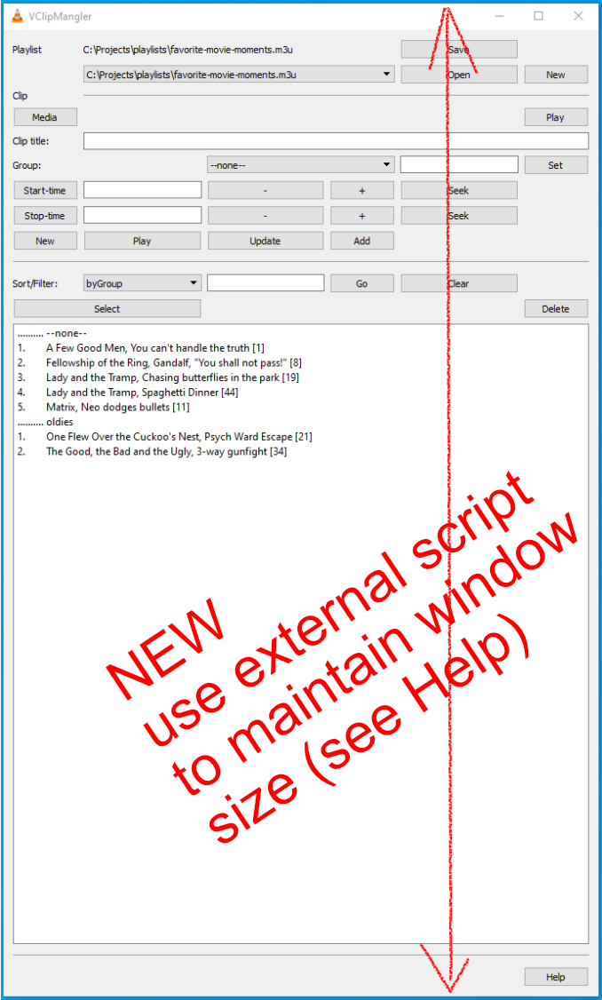

# VClipMangler

This is a VLC extension to create and manage playlists of virtual clips.



Create/manage m3u playlists of tracks ("clips"), with each clip assigned a title, start/stop times, group, etc.

Clips are "virtual" in that they are just metadata about a section of interest in longer media, and different clips can refer to different sections of the same media.

Use virtual clips to identify, organize, and play/repeat sections of instructional videos, scenes from movies, snatches of songs, etc.

(NB: playlists created can be used with any player that works with m3u files, not just VLC.)

## How to install

- download this repo
- extract/place VClipMangler.lua in your VLC extensions folder, usually `{your VLC folder}/lua/extensions`
- re-start VLC (or reload the extension as follows: click VLC menu > Tools > Plugins and Extensions, then in the dialog that appears click Active Extensions > Reload extensions)

## How to run

- (after installing as above)
- click VLC menu/View/Manage Virtual Clips

## How to use

(tbd; for now pls click the Help button in VClipMangler to see in-app help)

## Maintaining Window Size

One nuisance w/ the current extension is that it resizes to a VLC-managed default on most interactions. A low-tech workaround is to use an app or script to "watch" the extension window, and to resize it if below a minimum size. If we're not to have that script running all the time, we need it started when the extension is activated, and stopped when it's closed. To facilitate this we have ini-file settings `cmdOnActivate` and `cmdOnClose` (as of v0.5.0), and the command corresponding to each is called on VLC's extension-`activate` and -`close` events. Commands, run via VLC's `os.execute()` function, could be anything, and potentially dangerous -- caveat emptor.

On Windows I haven't found an app that locks window size w/o side effects, but an AutoHotkey script that watches the extension window and resizes it works well enough.

1. install [ql](https://github.com/ScienceDiscoverer/ql), a fabulous little utility that launches an app and gets out of the way; much easier than fiddling w/ switches to cmd.exe
1. install [AutoHotkey](https://www.autohotkey.com/)
1. create/save the following ahk file, e.g. in the same location as VClipMangler.ini (to see its location on your system, run VClipManger, click Help, see "Extension settings")

  ```ahk
    ; uses AutoHotkey legacy (pre-v2) syntax
    ; save as VClipMangler_resize.ahk (e.g. in same location as VClipMangler.ini)
    #Persistent 

    if (A_Args[1] == "--close") {
        Exitapp
    }

    ; edit X, Y, minW, minH, pollMs to suit
    defX     = 913
    defY     = 450
    minW     = 700
    minH     = 1150
    pollMs   = 2000
    winTitle = VClipMangler

    ; ===== no more configs below this line

    SetTitleMatchMode, 3 ; match exact
    SetTimer, lblCheckSize, %pollMs%

    lblCheckSize:
    WinGetPos, x, y, w, h, %winTitle%
    If (w < minW) Or (h < minH) {
        WinMove, %winTitle% , , defX, defY, minW, minH
        ; comment-out prior and uncomment following if you don't want to position window
        ; WinMove, %winTitle% , , , , minW, minH
    }
    return
  ```

1. add the following to VClipMangler.ini (edited for your installaton folders, of course)

  ```cmd
  cmdOnActivate=C:\utils\ql.exe """C:\Program Files\AutoHotkey\AutoHotkey.exe"" /r C:\Users\pakx\Documents\VClipMangler_resize.ahk"
  cmdOnClose=C:\utils\ql.exe """C:\Program Files\AutoHotkey\AutoHotkey.exe"" /r C:\Users\pakx\Documents\VClipMangler_resize.ahk --close"
  ```

1. re-start VLC (or reload the extension as follows: click VLC menu > Tools > Plugins and Extensions, then in the dialog that appears click Active Extensions > Reload extensions)
